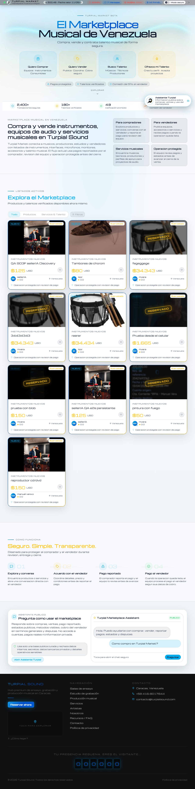
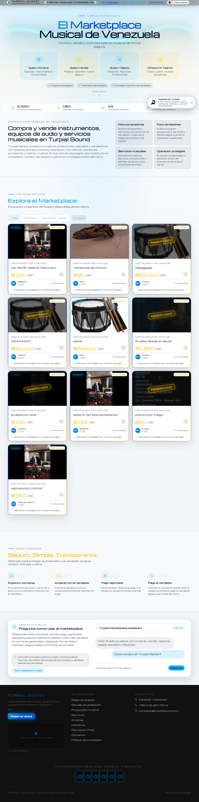

# S11 — Playwright Login UI Smoke Report

**Fecha:** 2026-05-11T10:15:05.415Z
**APP_URL:** https://turpialsound-qc6k39eh1-bkgs-projects-829c67c1.vercel.app
**Branch:** Manuel/s11-playwright-login-ui-2026-05-12

## Resultado

- Total: 3
- PASS: 3
- FAIL: 0
- Estado: TODOS PASS

## Resultados Login Smoke

| Usuario | Identificador | Esperado | Header | Estado |
|---------|---------------|----------|--------|--------|
| BUYER | buyerIA | buyerIA | buyerIA | PASS |
| SELLER | sellerIA | sellerIA | sellerIA | PASS |
| ADMIN | mvera | mvera | mvera | PASS |

## Screenshots

Ver directorio: `var/qa-results/s11-login-report/`

- 
- 
- 
- 
- 
- 

## Credenciales usadas

| Rol | Identificador |
|-----|---------------|
| BUYER | buyerIA |
| SELLER | sellerIA |
| ADMIN | mvera |
